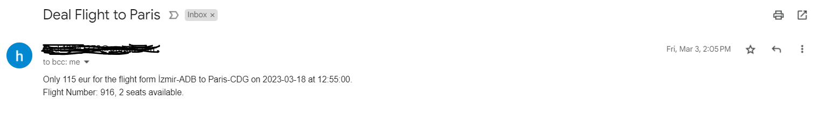

# Cheap_Flight_Finder
Finding deal flights using Tequila, Kiwi and Sheety APIs

the users are registered using users.py 
the main.py checks for every user's desired destination and then looks for the prices below the desired user price. if there exists a suitable flight, it sends an Email to the user.
the Email looks like this:

